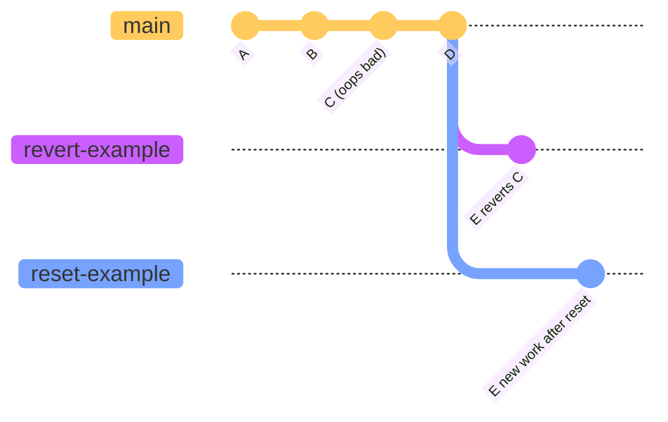

**git revert vs git reset**

**git revert**
- creates a *new* commit that undoes changes from a previous commit
- does not alter the history(therefore unsafe ig)
- syntax: `git revert <commit-id>`
- keeps all history intact, just adds a new "undo" commit on top
- good when you've already pushed and others might have your commits

**git reset**
- moves the branch pointer backward, basically head moves backward.
- three flavors:
  - `git reset --soft <commit>` - keeps changes staged
  - `git reset --mixed <commit>` - keeps changes unstaged (default)
  - `git reset --hard <commit>` - nukes everything, loses changes completely
- rewrites history, so can save you from sharing your keys, but can create mess as it alters the hstory.
- great for local cleanup before pushing

**tl;dr:**
- already pushed? use revert
- still have not pushed the changes to the remote repo yet? use revert
- want to keep changes? reset --soft or --mixed
- want to get rid of it all? reset --hard 
---

